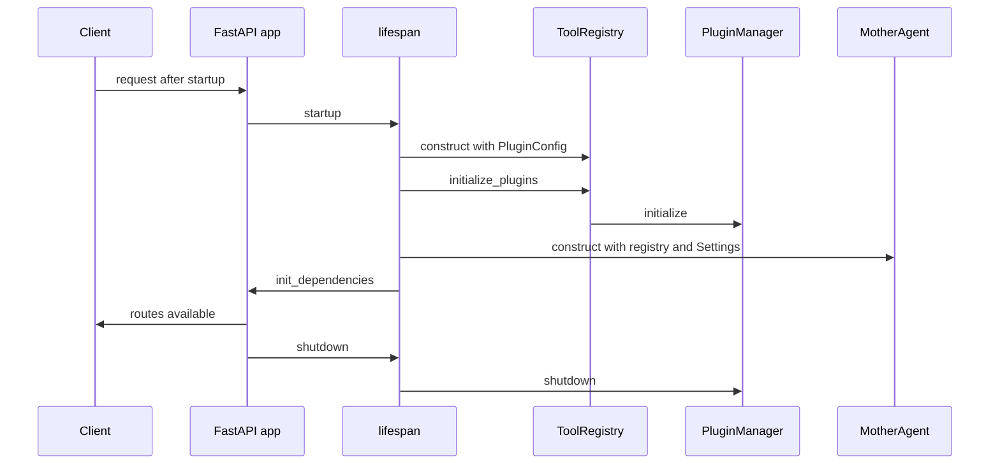

# Service runtime, API, and agent loop

Consult this page when changing request handling, dependency lifetime, the LLM tool loop, plans, confirmations, sessions, or semantic memory. [Plugin extension and execution](../plugins/extension-and-execution.md) owns what the runtime can invoke; [security control plane](../security/control-plane.md) owns the authorization and policy gates that plugin execution applies.

## Startup and shutdown

`mother.main:app` installs `lifespan` and includes `mother.api.routes.router`. On startup, `lifespan` obtains cached `Settings`, resolves explicitly enabled high-risk plugins through `resolve_enabled_plugins`, constructs `ToolRegistry`, awaits `initialize_plugins`, then constructs `MotherAgent` and calls `init_dependencies(registry, agent)`. Routes depend on those module-level dependencies. On shutdown, the plugin manager is awaited and asked to shut down.

**Invariant:** do not move route dependency installation before plugin initialization. The agent's dynamic capability schemas come from the registry, so an early route could expose an incompletely initialized capability set. `ToolRegistry.initialize_plugins` catches and logs its own initialization failure; the runtime consequently can still start with an empty plugin registry.

This sequence shows the source-backed service lifecycle in `mother/main.py` and `mother/tools/registry.py`.

## HTTP surface and authentication boundary

`mother/api/routes.py` defines the router. Most operational routes use `Depends(verify_api_key)`; `/status` does not in the current implementation, while `/health` is defined directly in `mother.main` and is also unauthenticated. Request and response shapes live in `mother/api/schemas.py`.

| Route family | Owning route function | Runtime target | Notes |
| --- | --- | --- | --- |
| `POST /command` | `execute_command` | `MotherAgent.process_command` | Returns text, session ID, tool-call records, and optional pending confirmation. |
| `POST /command/{session_id}/confirm` | `confirm_action` | `MotherAgent.confirm_action` | Rejects a session ID that is not `agent.get_session_id()` before executing. |
| `POST /plan`, plan execution routes | `create_plan` and related route functions | `MotherAgent` planning methods | Separates generation and approval/execution of an `ExecutionPlan`. |
| `GET /tools` | `list_tools` | `ToolRegistry.list_tools` | Lists plugin-derived tool metadata. |
| `GET /tools/{tool_name}` and `POST /tools/{tool_name}/{command}` | `get_tool_details`, `execute_tool_directly` | legacy `ToolWrapper` lookup | Registry documentation states wrappers were removed; these paths do not dispatch plugin capabilities today. |
| `/memory/stats`, `/memory/search` | memory route functions | `MotherAgent` memory methods | Return 404 when memory is unavailable for stats. |

Do not infer identity propagation from the HTTP route dependency alone: `verify_api_key` returns a string in these route signatures, whereas plugin executors accept an optional identity argument. Follow the actual call chain when introducing identity-aware execution; see [security control plane](../security/control-plane.md).

## Agent state and execution behavior

`MotherAgent` selects an `LLMProvider` from explicit `provider`, then `Settings` via `get_provider_for_settings`, then a legacy Anthropic fallback. It generates tool descriptions and Anthropic-format schemas from `ToolRegistry`; the registry delegates schemas and execution to `PluginManager`.

`AgentState` holds one current `session_id`, messages, tool results, a single `pending_confirmation`, confirmed action IDs, and pending/current plans. `PendingConfirmation` retains the capability arguments and action description. `register_action_describer` is an extension seam for plugin-owned, human-readable confirmation text without adding tool-specific logic to the agent core.

The system prompt calls out a behavioral contract: destructive actions may require confirmation, and the agent should present specific affected items for a verification request. Confirmation must remain tied to the stored action/session rather than treating a later natural-language request as approval.

### Sessions and memory

The constructor independently attempts `MemoryManager` and `SessionStore`; exceptions are logged and leave the corresponding feature unset instead of failing agent creation. `MemoryManager` writes conversation turns and tool results to `MemoryStore`; tool results are truncated to 2,000 characters before storage. Semantic recall embeds the query, excludes the current session, uses a default minimum similarity of 0.6, and can append recent observations from other sessions.

This persistence layer supplies context to the [agent loop](#agent-state-and-execution-behavior), but it is not the authorization system. Treat memory content as data that may be shown to the LLM, and keep policy/identity decisions in the execution layer.

## Change recipes and focused checks

### Add or change an HTTP operation

1. Define or update Pydantic request/response models in `mother/api/schemas.py`.
2. Add the route in `mother/api/routes.py`, using `get_agent` or `get_registry` only after `init_dependencies` can provide it.
3. Choose `verify_api_key` deliberately; `/status` and `/health` demonstrate that routes need not be authenticated, so exposure is a contract decision.
4. Add route-level behavior in `tests/test_api_routes.py` and serialization cases in `tests/test_api_schemas.py`.

Run `pytest -q tests/test_api_routes.py tests/test_api_schemas.py`. Also run `pytest -q tests/test_api_auth.py` when changing authentication dependencies. A full application invocation is conditional: use it only when testing actual provider credentials or deployment binding, neither of which focused tests require.

### Change confirmation, planning, or persistence

Start at `MotherAgent.process_command`, `confirm_action`, and planning methods in `mother/agent/core.py`. Preserve the state transitions for no pending action, matching confirmation, wrong confirmation ID, and wrong session ID. For persistence, cover construction failure paths as well as remember/recall boundaries. Analogous tests are in `tests/test_agent_core.py` (confirmation and tool loop), `tests/test_agent_session.py` (saved/restored sessions), and `tests/test_memory_manager.py` (store/recall behavior).

Run `pytest -q tests/test_agent_core.py tests/test_agent_session.py tests/test_memory_manager.py`. Add provider tests from `tests/test_llm_providers.py` only if provider selection or normalized response behavior changes.
