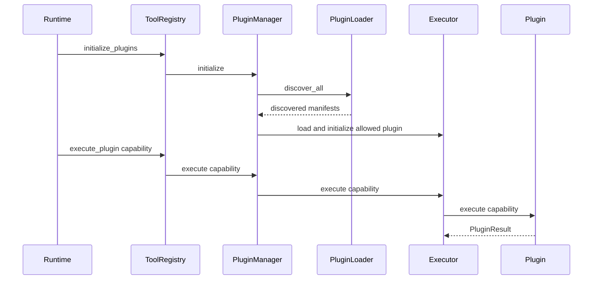

# Plugin discovery, contracts, and execution

Consult this page to add a capability, diagnose a missing plugin, alter enablement, or change a capability's execution semantics. The plugin system is the canonical extension surface that [service runtime and API](../architecture/runtime.md) uses through `ToolRegistry`; its authorization order is detailed in [security control plane](../security/control-plane.md).

## Architecture and lifecycle

`PluginManager` composes `PluginLoader`, `PluginRegistry`, and `SandboxManager`. `initialize` discovers plugins when `auto_discover` is enabled, then calls `load_all` when `auto_load` is enabled. `ToolRegistry` creates the manager and makes its schemas, list output, confirmation requirement, and `execute_plugin` call available to the agent.

This diagram describes manager-mediated capability flow. Validation gates inside `Executor` occur before `Plugin.execute`; see [security control plane](../security/control-plane.md) for the enforcement order.

## Discovery and enablement

`PluginLoader.discover_all` discovers in this order, with later sources able to override earlier names:

1. programmatic built-ins from `mother.plugins.builtin.get_builtin_plugin_classes`;
2. manifests within `mother/plugins/builtin/`;
3. installed Python entry points in group `mother.plugins`;
4. `~/.mother/plugins/`;
5. `.mother/plugins/` when the project directory exists.

The entry-point contract is public: a third-party package declares `[project.entry-points."mother.plugins"]`, and the target may be a `PluginBase` subclass whose module exports `MANIFEST`, or an object with `get_manifest`. Installed plugins are never implicitly added to the default high-risk allow list.

`PluginConfig` filters discovery with `enabled_plugins`, `disabled_plugins`, `allow_high_risk_plugins`, and `explicitly_enabled_plugins`. `resolve_enabled_plugins` is the shared server/CLI source of truth for `MOTHER_ENABLED_PLUGINS`: by default it returns `pdf` and `datacraft`; a defined empty value enables none. Keep that resolver and the policy configuration aligned whenever changing the default list.

## Capability contract and implementation seams

The public Python imports are exported from `mother/plugins/__init__.py`: `PluginBase`, `PluginResult`, `PluginManifest`, `CapabilitySpec`, `PluginManager`, executors, validation helpers, and exceptions. A plugin's manifest describes metadata, capabilities and parameter schema, execution type, permissions/risk, and optional configuration. `PluginBase` implementations supply asynchronous lifecycle and capability behavior; built-ins live under `mother/plugins/builtin/`.

The complete runtime registration chain for a new shipped built-in is:

1. implement `PluginBase` and a programmatic manifest, or provide a valid manifest with an execution specification;
2. add the class to `mother/plugins/builtin/__init__.py` so `get_builtin_plugin_classes` discovers it;
3. ensure `PluginLoader` can load the manifest/executor and `PluginManager` registers its capability names;
4. expose it through the running server's `ToolRegistry`, which is what `MotherAgent` gives to the LLM;
5. test its direct behavior plus discovery/registration and an agent or consumer path where applicable.

For third-party packages, steps 2 and 3 become package metadata in the consumer distribution's `pyproject.toml`; the real consumer import/discovery path is the `mother.plugins` entry-point group, not a local edit to Mother's built-in registry. Follow the current detailed examples and schema fields in [`docs/dev/INTEGRATION_CONTRACT.md`](../../docs/dev/INTEGRATION_CONTRACT.md).

`create_executor` supports Python and CLI implementations. `ExecutorBase` supplies timeout selection and shared scope, policy, and parameter checks; do not duplicate those checks inside a plugin to compensate for a missing manifest contract. The manager's `PluginRegistry` creates full identifiers such as `plugin_capability`; the agent uses those schemas rather than legacy wrappers.

## Change recipes

### Add a capability to an existing plugin

Update the plugin's `PluginManifest` capability list and its `PluginBase.execute` dispatch together. Declare parameter types/defaults and set `confirmation_required` for destructive operations. Check permission/risk classification and policy rules as one change; a schema that reaches the LLM but is blocked by policy may be correct, but it must be intentional. Add behavior tests in the relevant `tests/test_builtin_<name>.py`, manifest assertions in `tests/test_plugin_manifest.py`, and manager visibility coverage when naming/registration changes.

Run `pytest -q tests/test_plugin_manifest.py tests/test_plugin_manager.py tests/test_builtin_<name>.py`. Escalate to `tests/test_agent_core.py` if the capability's schema or confirmation behavior changes; a plugin-only test does not prove that the capability is available to an LLM consumer.

### Change discovery or high-risk admission

Start with `PluginLoader.discover_all`, `PluginManager.discover`/`load_all`, and `resolve_enabled_plugins`. Preserve source precedence, failure recording as `PluginInfo.failed`, and the rule that high-risk admission is configuration based. Test ordinary discovery, same-name override behavior, disabled/explicitly enabled cases, and server/CLI parity where defaults change.

Run `pytest -q tests/test_plugin_loader.py tests/test_plugin_manager.py tests/test_tool_availability.py`. Run `pytest -q tests/test_high_risk_plugins.py tests/test_tor_plugins.py` when risk filtering affects high-risk built-ins.

## Scope boundary

`mother/tools/registry.py` is a compatibility adapter, not a second capability model. Its `wrappers` are empty by design and its direct wrapper APIs do not expose plugin capabilities. Do not update only a legacy wrapper or only `/tools/{tool_name}/{command}` and assume shipped plugin execution is covered. The consumer-facing verification for a new plugin is manager discovery plus schema/agent availability.
