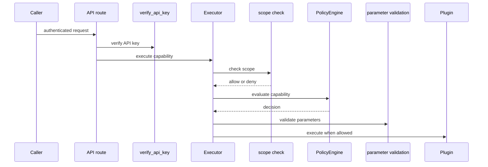

# Authentication, scope, policy, sandbox, and audit controls

Consult this page for changes that can affect who may use the service or what a capability is permitted to do. [Service runtime and API](../architecture/runtime.md) documents which routes require `verify_api_key`; [plugin extension and execution](../plugins/extension-and-execution.md) documents how a capability becomes executable.

## Control layers

- **Request API key:** `mother/api/auth.py::verify_api_key` is the FastAPI dependency applied to most command, tool, plan, and memory routes.
- **Stored identity:** `APIKeyStore` in `mother/auth/keys.py` persists key hashes, role, scopes, expiry/revocation state, and last-use data in SQLite at `~/.config/mother/keys.db` by default. It creates high-entropy `mk_` keys, hashes them with SHA-256, and only returns the raw generated key during creation.
- **Scope:** `ExecutorBase.check_scope` delegates to `mother.auth.scopes.check_scope` before policy evaluation when an identity is supplied.
- **Policy:** `ExecutorBase.check_policy` asks the process-wide policy engine about a full `plugin_capability` name. `PolicyEngine` evaluates safe mode, hard conditions, priority-ordered matching rules, then a default action.
- **Parameters and execution:** executors validate schema parameters after scope and policy pass, then invoke the plugin under its configured capability timeout.
- **Sandbox and audit:** `PluginSandbox`/`SandboxManager` provide plugin permission isolation infrastructure; `AuditLogger` writes redacted JSONL events with correlation and policy fields. The external tool registry, rather than every executor call, currently imports and emits through `get_audit_logger`; do not claim universal execution-event logging without tracing the relevant caller.

This is the enforcement sequence implemented by `BuiltinExecutor.execute` in `mother/plugins/executor.py`: scope, policy, then parameter validation all happen before plugin execution. A scope or policy failure is converted to a `PluginResult` error with rule/risk metadata instead of reaching plugin code.

## Policy semantics that changes must preserve

`PolicyEngine.evaluate` performs safe-mode restriction first. In safe mode, a high-risk capability needs an explicit allow rule. It then evaluates hard filesystem, command, data, and network conditions before matching policy rules. A condition denial therefore takes precedence even if a later rule might allow an action. Matching rules are returned in priority order; the first decision wins. `DENY`, `ALLOW`, `CONFIRM`, and `AUDIT` produce distinct `PolicyDecision` forms, and the default applies only when no earlier mechanism decides.

High-risk matching includes shell, Tor, Tor shell, robin OSINT prefixes and destructive/execute suffix patterns. This list is a security boundary, not a user-interface hint. Changes must test safe-mode behavior and explicit allow behavior, not merely that a capability appears in a plugin list.

## Audit data and persistence boundaries

`AuditEntry` defines structured JSONL fields including timestamp, correlation/session identifiers, actor, capability/plugin, action/risk, redacted parameters/result, and duration. `AuditLogger` is thread-safe, can buffer writes, rotates files by size/startup configuration, and redacts values through the shared redactor before serialization. Default settings place the audit file at `./logs/audit.jsonl`; key data has a separate SQLite store. Neither file is a substitute for policy decisions.

Configuration is read through `Settings` in `mother/config/settings.py`: `MOTHER_SAFE_MODE` defaults to true, `MOTHER_REQUIRE_AUTH` defaults to true, and audit/sandbox settings are available. Keep secrets out of docs and test fixtures; use placeholders and isolated temporary paths.

## Change recipes and tests

### Change keys, roles, or scopes

Start in `mother/auth/models.py`, `keys.py`, and `scopes.py`, then inspect `mother/api/auth.py` for how HTTP credentials become request state. Preserve hash-only storage, one-time raw-key return, revocation/expiration checks, and last-use update behavior. Test identity construction, key lifecycle, each role/scope allow-deny outcome, and authentication response behavior.

Run `pytest -q tests/test_auth_keys.py tests/test_api_auth.py`. Run `pytest -q tests/test_api_routes.py` if applying the dependency to a new route or changing a route's exposure.

### Change policy or executor enforcement

Update policy model/loader/engine behavior and executor handling together only where their contract changes. The behavioral matrix must cover safe-mode blocked, explicit allow, hard-condition denial, priority/order conflict, no matching rule default, scope denial before policy, policy denial before validation/execution, invalid parameters after authorization, and timeout/error conversion. The relevant suites are `tests/test_policy.py`, `tests/test_executor.py`, and `tests/test_plugin_sandbox.py`.

Run `pytest -q tests/test_policy.py tests/test_executor.py tests/test_plugin_sandbox.py`. Add `tests/test_high_risk_plugins.py` for admission changes. Full integration or deployment checks are conditional on changes to environment loading, packaged policy files, or container permissions.

### Change audit behavior

Use `AuditEntry` and `AuditLogConfig` as the contract. Preserve redaction before JSON serialization, buffer flushing/close behavior, and rotation retention. Run `pytest -q tests/test_audit.py`; include `tests/test_tools_external_registry.py` only when the external tool registry's audit events change.
